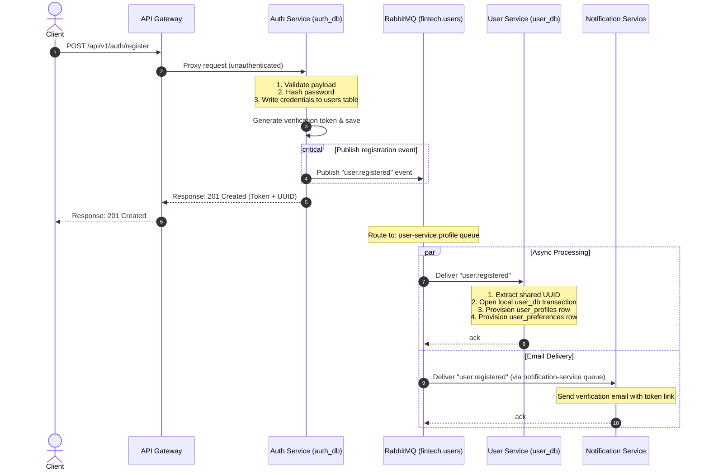
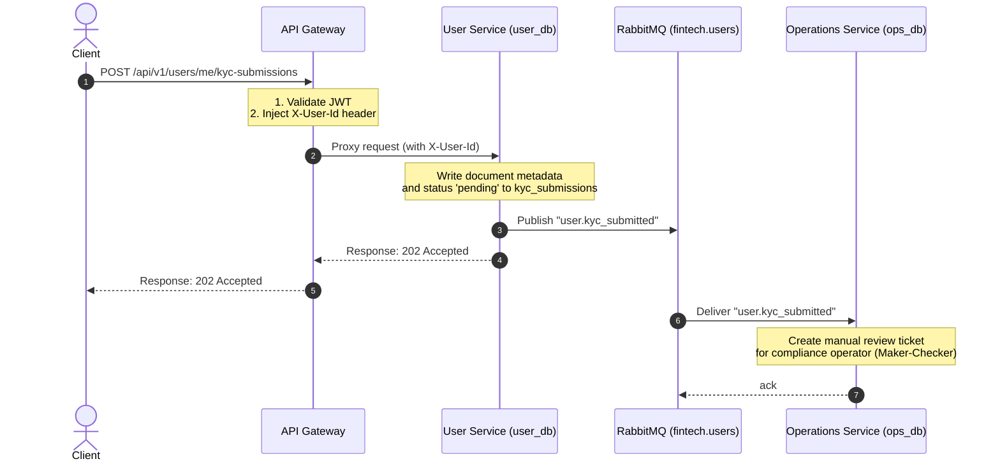
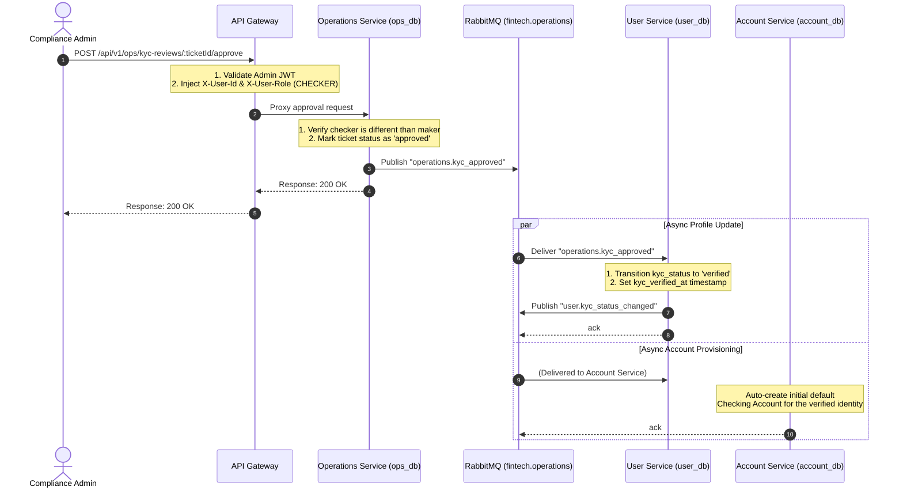
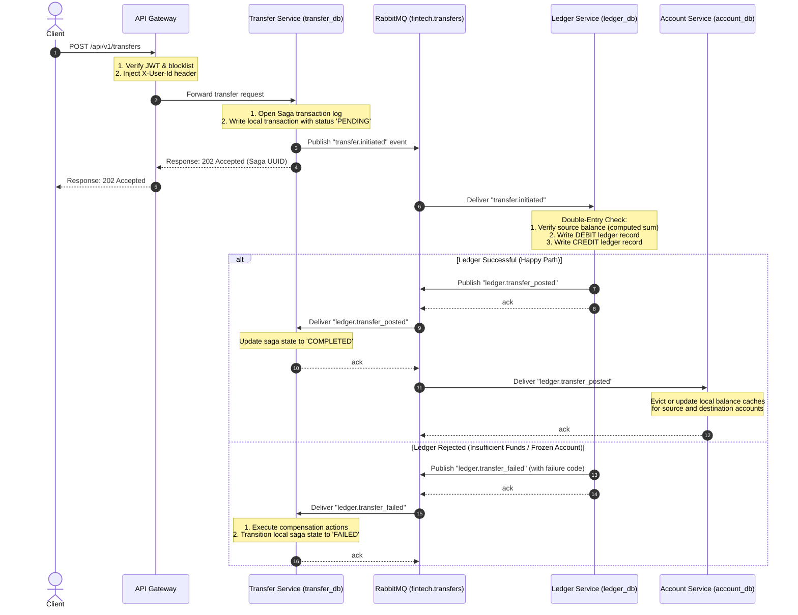
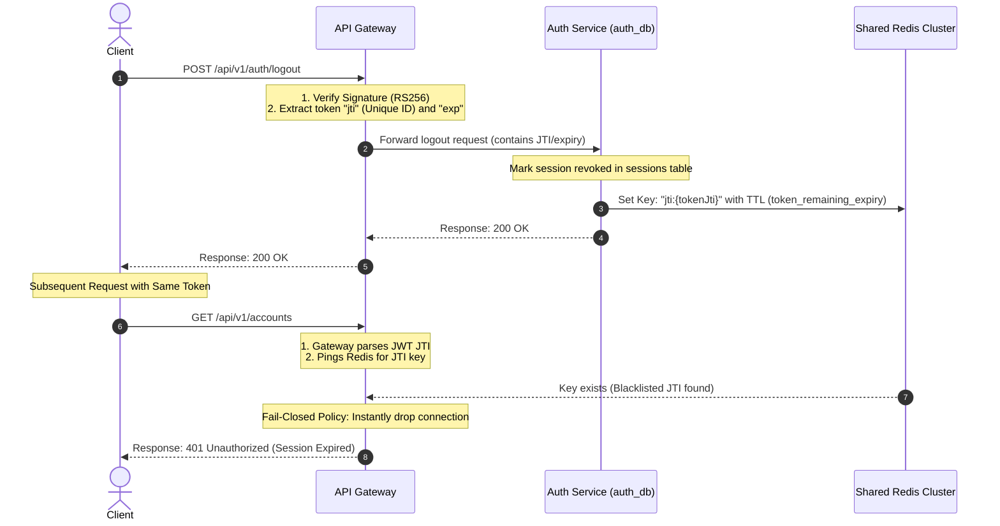

# 🗺️ Cross-Service User Journey Flows

This document details the end-to-end, multi-service operational flows for critical actions inside the microserviced fintech platform. These diagrams and sequences trace requests as they cross the API Gateway, interact with core databases, publish/consume events via RabbitMQ, and maintain distributed transactional integrity.

---

## 1. Onboarding, Registration & Profile Provisioning

This flow illustrates how the system registers credentials and asynchronously builds the user profile across database boundaries.

---

## 2. Onboarding: Verification & KYC Submission

---

## 3. Operations: KYC Maker-Checker Approval Pipeline

All status shifts to `verified` are protected by a manual verification loop:

---

## 4. Financial Transactions: The Transfer Saga Pipeline

Because accounts and balance journals reside in different databases, transfer orchestrations use an event-driven Saga pipeline.

---

## 5. Security & Session Termination: Logout Revocation Loop

When a user logs out, the JWT session is blacklisted immediately at the edge layer without querying central databases on subsequent requests.

